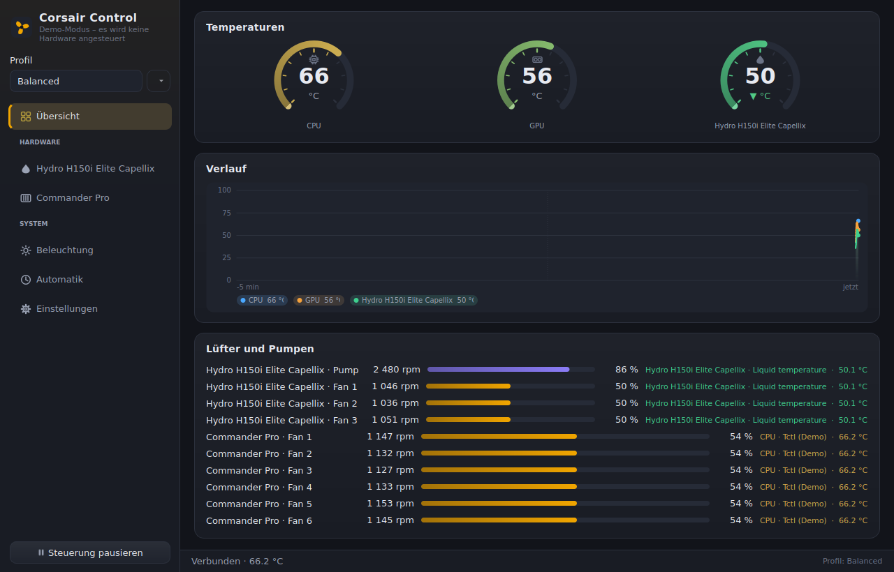
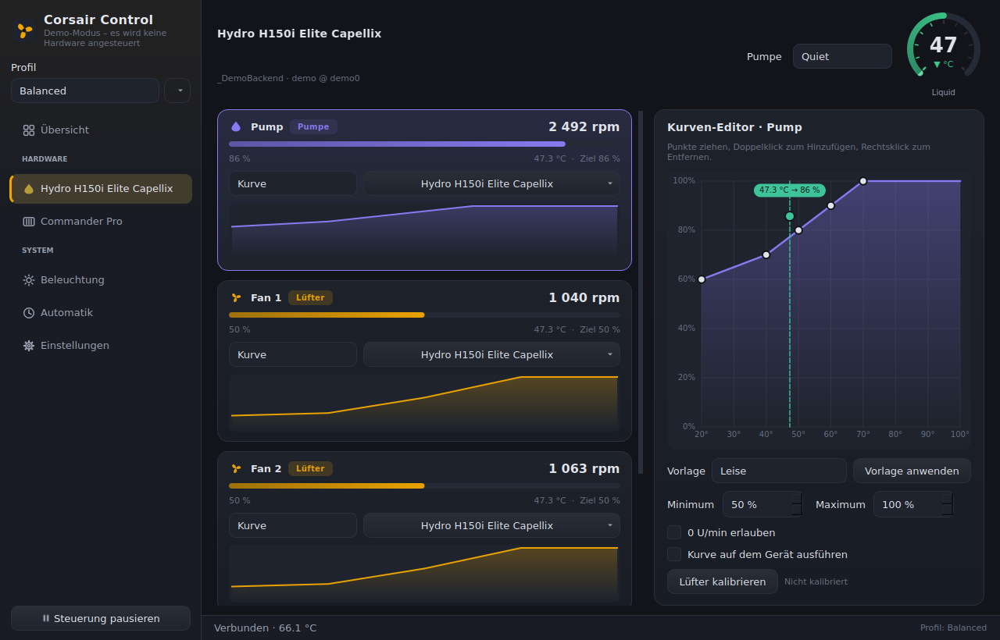
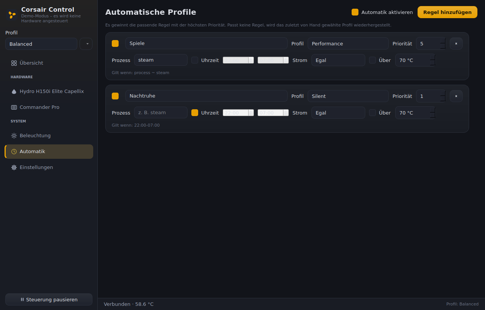
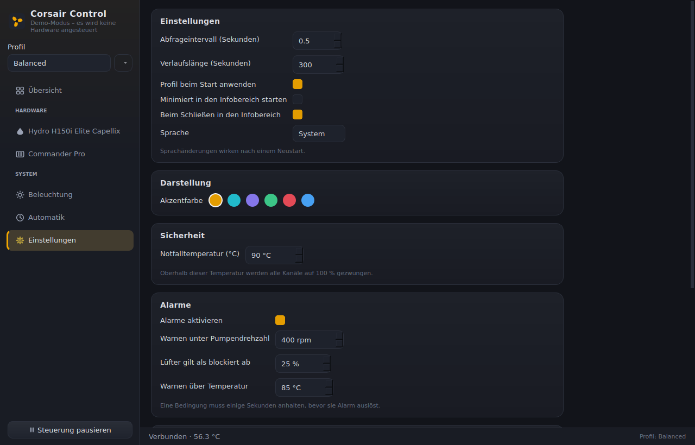

# Corsair Control

Ein grafisches Programm für Linux, mit dem sich Corsair-Lüfter, AIO-Wasserkühlungen
und Lüfter-Hubs vernünftig ansteuern lassen: Lüfterkurven per Maus zeichnen,
Temperaturquelle frei wählen, Profile umschalten, und optional ein Dienst im
Hintergrund, der die Kurven auch ohne offenes Fenster weiterfährt.









---

## Was es macht

* **Automatische Geräteerkennung** über [liquidctl](https://github.com/liquidctl/liquidctl)
  – Hydro-/iCUE-AIOs, Commander Pro, Commander Core, Lüfter-Hubs.
* **Mainboard-Lüfter inklusive**: Kanäle aus `/sys/class/hwmon/*/pwmN` laufen
  über dieselben Kurven und Profile wie die Corsair-Hardware. Schreiben braucht
  root – dafür gibt es den Dienst.
* **Lüfterkurven mit der Maus**: Punkte ziehen, Doppelklick fügt hinzu,
  Rechtsklick entfernt. Der aktuelle Betriebspunkt wird live auf der Kurve
  eingezeichnet.
* **Mehrere Temperaturquellen pro Kanal**: „wärmster von CPU und GPU“,
  Mittelwert oder gewichtete Mischung – wählbar pro Kanal.
* **Freie Temperaturquelle pro Kanal**: CPU, GPU, Wassertemperatur der AIO,
  NVMe – alles was unter `/sys/class/hwmon` auftaucht, dazu NVIDIA-GPUs über
  `nvidia-smi` und virtuelle Sensoren wie „heißster CPU-Sensor“.
* **Lüfter-Kalibrierung**: einmal 0 → 100 % durchfahren, dann kennt die App die
  Drehzahl je Stufe, den Stillstandspunkt und die Anlaufleistung. Der
  Kurven-Editor schattiert danach den Bereich, in dem dieser Lüfter steht, und
  zeigt zu jedem Punkt die zu erwartende Drehzahl.
* **Automatische Profilumschaltung** nach laufendem Prozess, Uhrzeit,
  Netz-/Akkubetrieb oder Temperatur – mit Prioritäten.
* **Alarme** für stille Fehler: Pumpe unter Mindestdrehzahl, Lüfter steht trotz
  Sollwert, Gerät verschwunden, Temperatur über Warnschwelle.
* **Aufzeichnung**: Messwerte laufend in eine Tages-CSV, plus Export des
  aktuellen Verlaufs auf Knopfdruck.
* **Ruhiges Regelverhalten**: gleitender Mittelwert auf der Temperatur plus
  Hysterese auf der Ausgabe. Hochdrehen darf die Regelung schnell, runter nur
  träge – sonst atmen die Lüfter hörbar um jeden Kurvenknick herum.
* **Profile** (Leise / Ausgewogen / Leistung / eigene) mit Umschaltung aus dem
  Fenster oder aus dem Tray-Menü.
* **Pumpensicherheit**: Pumpenkanäle bekommen automatisch eine Untergrenze von
  50 %, und keine Kurve darf einen Lüfter unbeabsichtigt auf 0 U/min stellen –
  0 U/min muss man pro Kanal ausdrücklich erlauben.
* **Notfallabschaltung nach oben**: ab einer einstellbaren Temperatur
  (Vorgabe 90 °C) gehen alle Kanäle auf 100 %, unabhängig von der Kurve.
* **Beleuchtung**: Modi des Treibers, mehrere Farben pro Modus, Geschwindigkeit
  und Richtung wo unterstützt, plus „auf alle Geräte anwenden“.
* **LCD-Displays** (experimentell): Geräte mit `set_screen` bekommen einen
  Block für Modus, Bild/GIF, Helligkeit und Ausrichtung.
* **Optik**: dunkles Thema mit wählbarer Akzentfarbe, animierte Anzeigen,
  Verlaufsdiagramm mit Fadenkreuz beim Überfahren.
* **Hintergrunddienst** (`corsair-controld`) mit systemd-Unit, damit die Kurven
  schon vor dem Login laufen.
* **Demo-Modus** (`--demo`) mit simulierter AIO und simuliertem Commander Pro –
  zum Ausprobieren ohne Hardware.

### Ehrliche Einordnung

Ganz leer ist das Feld nicht: [liquidctl](https://github.com/liquidctl/liquidctl)
deckt die Hardware-Kommunikation auf der Kommandozeile ab, und
[CoolerControl](https://gitlab.com/coolercontrol/coolercontrol) ist eine
existierende GUI mit ähnlichem Ziel. Dieses Projekt setzt auf liquidctl als
Backend auf und konzentriert sich auf einen direkten, aufgeräumten Kurven-Editor
plus einen schlanken Dienst. Wenn dir eine der beiden Alternativen besser passt –
nimm sie, sie sind gut.

---

## Unterstützte Hardware

Alles, was liquidctl als Corsair-Gerät mit Lüfter- oder Pumpenkanal erkennt,
unter anderem:

| Gerät | Anmerkung |
| --- | --- |
| Hydro H80i/H100i/H115i/H150i (Platinum, Pro XT, Elite Capellix, Elite LCD) | Pumpe teilweise über Modi statt Prozentwert |
| iCUE Link System Hub, Commander Core / Core XT | Kanäle je nach Firmware |
| Commander Pro, Lighting Node Pro/Core | Hardware-Kurven möglich |
| Obsidian 1000D Commander | wie Commander Pro |
| HXi/AXi-Netzteile | nur Auslesen, kein Lüfterkanal |
| Mainboard-Lüfteranschlüsse | über hwmon (`nct6xxx`, `it87` …), Schreiben nur als root |

Ob dein Gerät dabei ist, sagt dir:

```bash
corsair-control --list
```

Kanäle, die der Treiber nur lesen kann, werden in der Oberfläche als
„nicht steuerbar“ markiert statt still zu scheitern.

---

## Installation

### Schnellweg

```bash
git clone https://github.com/keprep/Corsair.git
cd Corsair
./install.sh              # nur für den aktuellen Benutzer
./install.sh --daemon     # zusätzlich den Hintergrunddienst einrichten
```

Das Skript legt eine virtuelle Umgebung an, installiert das Programm samt
Abhängigkeiten, hinterlegt Desktop-Eintrag und Icon und installiert die
udev-Regeln. `./install.sh --uninstall` entfernt alles wieder; deine Profile
bleiben erhalten.

### Von Hand

```bash
python3 -m venv ~/.local/share/corsair-control/venv
~/.local/share/corsair-control/venv/bin/pip install .
sudo install -m 644 packaging/60-corsair-control.rules /etc/udev/rules.d/
sudo udevadm control --reload-rules && sudo udevadm trigger
```

Danach das Gerät **einmal ab- und wieder anstecken** (oder neu starten), damit
die Regeln greifen.

### Warum udev-Regeln?

USB-HID-Geräte gehören unter Linux standardmäßig root. Ohne Regel bekämst du
`Permission denied` – oder müsstest das Programm als root starten, was für eine
GUI keine gute Idee ist. Die mitgelieferte Regel vergibt den Zugriff per
`uaccess` an den lokal angemeldeten Benutzer.

---

## Benutzung

```bash
corsair-control                 # Fenster öffnen
corsair-control --demo          # ohne Hardware ausprobieren
corsair-control --list          # Textübersicht: Geräte, Kanäle, Sensoren
corsair-control --dry-run       # echte Geräte lesen, aber nichts schreiben
corsair-control --profile Leise # mit einem bestimmten Profil starten
corsair-control --lang en       # Oberfläche auf Englisch
```

### Kurven bearbeiten

1. Links in der Seitenleiste das Gerät wählen.
2. Auf die Karte des gewünschten Kanals klicken – rechts erscheint der Editor.
3. Modus auf **Kurve** stellen und die Temperaturquelle wählen.
4. Punkte ziehen. Doppelklick auf freie Fläche fügt einen Punkt hinzu,
   Rechtsklick auf einen Punkt entfernt ihn, Pfeiltasten verschieben ihn
   feinfühlig (mit Shift in 5er-Schritten).

Änderungen wirken sofort und werden nach kurzer Zeit automatisch gespeichert.

**Mehrere Sensoren pro Kanal**: Der Sensor-Knopf auf der Kanal-Karte öffnet eine
Liste zum Ankreuzen. Sind mehrere gewählt, entscheidet der Modus unten im Menü,
was daraus wird – „Wärmster“ ist die Vorgabe und meist die richtige Antwort.

**Kalibrierung**: Der Knopf „Lüfter kalibrieren“ im Kurven-Editor fährt den
Kanal einmal durch. Das dauert ein bis zwei Minuten, der Lüfter wird laut und
bleibt zwischendurch stehen – danach kennt die App seine Kennlinie und hebt bei
Bedarf die Untergrenze auf einen Wert an, bei dem er sicher weiterläuft.

### Automatische Profile

Auf der Seite „Automatik“ legst du Regeln an: Bedingung → Profil. Bedingungen
sind Prozessname (Teilstring, z. B. `steam`), Zeitfenster (auch über Mitternacht),
Netz- oder Akkubetrieb und eine Temperaturschwelle. Mehrere Bedingungen in einer
Regel gelten mit **und**. Passt mehr als eine Regel, gewinnt die höchste
Priorität; passt keine, kommt das zuletzt von Hand gewählte Profil zurück.

### Alarme

Standardmäßig aktiv: Pumpe unter 400 U/min, Lüfter mit ≥ 25 % Sollwert aber
0 U/min, Gerät nicht mehr erreichbar, Temperatur über 85 °C. Eine Bedingung muss
einige Sekunden anhalten, bevor sie meldet – ein einzelner Ausreißer im
Tachosignal ist kein Fehler. Alarme erscheinen als Banner und als
Systembenachrichtigung.

### Aufzeichnung

In den Einstellungen lässt sich die laufende Aufzeichnung einschalten; sie legt
pro Tag eine CSV in `~/.local/state/corsair-control/` an (bzw.
`/var/lib/corsair-control/` beim Dienst) und räumt nach der eingestellten
Aufbewahrungszeit auf. „Verlauf als CSV exportieren“ schreibt den aktuell im
Speicher gehaltenen Verlauf in eine Datei deiner Wahl.

**Modi pro Kanal**

* **Kurve** – geregelt nach der eingezeichneten Kurve.
* **Fest** – fester Prozentwert, per Schieberegler; während des Ziehens hörst du
  die Änderung sofort.
* **Nicht steuern** – dieser Kanal wird in Ruhe gelassen (z. B. wenn das BIOS
  ihn regeln soll).

**Kurve auf dem Gerät ausführen** schreibt die Kurve einmalig in den Controller,
sofern dieser das kann (z. B. Commander Pro). Sie läuft dann auch weiter, wenn
das Programm gar nicht gestartet ist – dafür sieht man in der Oberfläche keinen
Regeleingriff mehr.

### Hintergrunddienst

```bash
sudo systemctl enable --now corsair-controld
systemctl status corsair-controld
journalctl -u corsair-controld -f
```

Der Dienst nutzt `/etc/corsair-control/profiles.json`. Ändert die GUI (als
root gestartet oder durch Kopieren der Datei) diese Datei, übernimmt der Dienst
das innerhalb weniger Sekunden ohne Neustart.

> Wenn Dienst **und** GUI gleichzeitig laufen, schreiben zwei Regler auf dieselbe
> Hardware. Für den Alltag: entweder den Dienst nutzen **oder** die GUI – oder in
> der GUI „Steuerung pausieren“ drücken, solange der Dienst regelt.

---

## Konfiguration

| Datei | Zweck |
| --- | --- |
| `~/.config/corsair-control/profiles.json` | Profile, Kurven, Kanaleinstellungen |
| `~/.config/corsair-control/settings.json` | Abfrageintervall, Notfalltemperatur, Sprache … |
| `/etc/corsair-control/profiles.json` | dasselbe, wenn als root/Dienst gestartet |

Beides ist lesbares JSON und darf von Hand bearbeitet werden. Über die
Umgebungsvariable `CORSAIR_CONTROL_CONFIG_DIR` lässt sich ein anderer Ort wählen.

---

## Fehlersuche

**„Keine Berechtigung“ / `Permission denied`**
udev-Regeln installiert? Gerät danach neu angesteckt? Prüfen mit
`ls -l /dev/hidraw*` – dein Benutzer sollte Lese-/Schreibrechte haben.

**Kein Gerät gefunden**
`lsusb | grep 1b1c` zeigt, ob der Kernel das Gerät überhaupt sieht.
`corsair-control --list` nennt danach den Grund, warum ein gefundenes Gerät
nicht benutzt werden kann.

**Werte springen, Lüfter pumpen**
Abfrageintervall in den Einstellungen erhöhen (z. B. 2–3 s) und die Kurve
flacher zeichnen. Die Hysterese verhindert Zappeln, kann aber gegen eine sehr
steile Kurve wenig ausrichten.

**Gerät reagiert nicht mehr, nachdem OpenRGB lief**
OpenRGB, liquidctl und dieses Programm greifen auf dieselben HID-Endpunkte zu.
Immer nur eines davon gleichzeitig laufen lassen.

**Lüfter bleiben nach dem Beenden langsam**
Das ist so gewollt – die letzte gesetzte Drehzahl bleibt in der Hardware stehen.
Der Dienst kann beim Beenden auf sichere Werte zurückstellen:
`corsair-controld --restore-on-exit`.

---

## Entwicklung

```bash
python3 -m venv .venv
.venv/bin/pip install -e '.[dev]'
.venv/bin/python -m pytest          # 132 Tests, laufen ohne Hardware
QT_QPA_PLATFORM=offscreen .venv/bin/python -m pytest tests/test_ui.py
```

Aufbau:

```
corsair_control/
├── core/          # Qt-frei: Geräte, Sensoren, Kurven, Regelschleife
│   ├── device.py    Abstraktion über liquidctl (+ Demo-Hardware)
│   ├── sensors.py   hwmon, nvidia-smi, virtuelle Sensoren
│   ├── curve.py     Kurvenmodell, Interpolation, Hysterese
│   ├── hwmon.py     Mainboard-Lüfter über /sys/class/hwmon
│   ├── calibration.py  Kennlinien-Messung je Kanal
│   ├── automation.py   Regeln für automatische Profilwahl
│   ├── alarms.py    Pumpe/Lüfter/Temperatur überwachen
│   ├── recorder.py  CSV-Aufzeichnung und Export
│   ├── engine.py    Regelschleife, erzeugt Snapshots für die UI
│   └── profile.py   Profile und deren Persistenz
├── ui/            # PyQt6: Fenster, Seiten, selbstgezeichnete Widgets
├── app.py         # GUI-Einstiegspunkt
└── daemon.py      # Dienst ohne Qt
```

`core` kennt Qt nicht – deshalb kann derselbe Regelcode im Dienst und in der
Oberfläche laufen, und deshalb lässt er sich ohne Display testen.

---

## Lizenz

GPL-3.0-or-later, siehe [LICENSE](LICENSE).

Dieses Projekt steht in keiner Verbindung zu Corsair Gaming, Inc.
